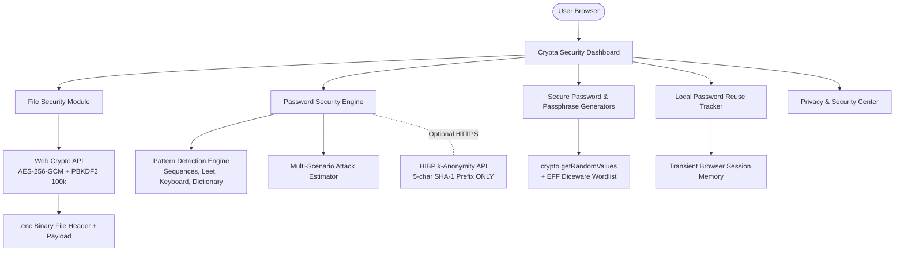

# 🔐 CRYPTA — Client-Side Encryption & Password Security Toolkit

> **Protect your files. Strengthen your passwords. Keep your secrets private.**

Crypta is a privacy-first, browser-native cybersecurity toolkit combining military-grade **AES-256-GCM file encryption** with an explainable **password security engine**, **k-anonymity breach detection**, **session-based password reuse analysis**, and cryptographically secure **password/passphrase generators**.

All cryptographic operations and security analyses execute 100% locally inside your browser using the native **Web Crypto API**. Zero plaintext files or passwords ever leave your device.

---

## 📑 Table of Contents
- [📖 Overview](#-overview)
- [✨ Key Features](#-key-features)
- [🏗️ System Architecture](#️-system-architecture)
- [🔒 File Security Module](#-file-security-module)
- [🛡️ Password Security Engine](#️-password-security-engine)
- [⚡ Attack Resistance Models](#-attack-resistance-models)
- [🕵️ Privacy-Preserving Breach Exposure Check](#️-privacy-preserving-breach-exposure-check)
- [🔄 Local Password Reuse Detection](#-local-password-reuse-detection)
- [🎲 Secure Generators](#-secure-generators)
- [🛡️ Privacy & Threat Model Summary](#️-privacy--threat-model-summary)
- [🚀 Quick Start & Installation](#-quick-start--installation)
- [🧪 Automated Testing](#-automated-testing)
- [🌐 Browser Compatibility](#-browser-compatibility)
- [📄 License & Author](#-license--author)

---

## 📖 Overview

Standard web tools often process sensitive files and passwords on remote backend servers, creating risk of data interception, server-side breach, or unannounced data logging. 

**Crypta** solves this by performing all cryptographic functions locally within the user's browser using industry-standard Web Crypto primitives:
- **AES-GCM (256-bit)** authenticated encryption ensures data confidentiality and tamper detection.
- **PBKDF2 SHA-256 (100,000 iterations)** derives keys with high brute-force resistance.
- **k-Anonymity SHA-1 lookup** checks breach databases without transmitting plaintext passwords.

---

## ✨ Key Features

- **🔐 100% Client-Side File Encryption & Decryption**: Zero server storage or file uploads.
- **🔑 Explainable Password Security Engine**: 0–100 Crypta Security Estimate with itemized strengths and weaknesses.
- **⚡ Multi-Scenario Attack Resistance**: Evaluates resistance against online rate-limited, offline fast GPU hash, and offline slow KDF attacks.
- **🕵️ Privacy-Preserving Breach Check**: Uses Have I Been Pwned k-Anonymity API (sending only 5-character SHA-1 prefix).
- **🔄 Local Password Reuse Detection**: In-memory session tracking for multi-account password reuse warnings.
- **🎲 Non-Deterministic Generators**: Password and EFF Diceware passphrase generation using `crypto.getRandomValues()`.
- **🌙 Modern Cybersecurity SaaS UI**: Responsive dark theme with glassmorphism cards and interactive security indicators.
- **🧪 100% Test Coverage**: Native Node.js test suite for cryptography, analyzer, generators, and breach/reuse logic.

---

## 🏗️ System Architecture



---

## 🔒 File Security Module

Crypta uses authenticated **AES-256-GCM** encryption paired with **PBKDF2 key derivation**.

### Cryptographic Configuration (`src/crypto/securityConfig.js`)
| Parameter | Value |
| :--- | :--- |
| **Cipher Algorithm** | AES-256-GCM (256-bit key) |
| **KDF Algorithm** | PBKDF2 HMAC-SHA-256 |
| **KDF Iterations** | 100,000 iterations |
| **Salt** | Cryptographically random 16 bytes per file |
| **IV / Nonce** | Cryptographically random 12 bytes per file |
| **Header Format** | `CRYPTA` (6B) + `FILENAME_LEN` (2B) + `FILENAME` + `SALT` (16B) + `IV` (12B) + `CIPHERTEXT` |

---

## 🛡️ Password Security Engine

Rather than relying on basic character counting, Crypta inspects passwords across 20 structural parameters:
1. **Length Boundaries** (Critical <8, Weak 8-11, Moderate 12-15, Strong 16+)
2. **Character Diversity** (Uppercase, Lowercase, Digits, Symbols)
3. **Repeated Character Blocks** (e.g., `aaaaa`, `1111`)
4. **Repeated Substrings** (e.g., `abcabc`, `passpass`)
5. **Sequential Alphanumerics** (e.g., `12345`, `abcde`, `zyx`)
6. **Keyboard Walks** (e.g., `qwerty`, `asdfgh`, `zxcvbn`)
7. **Dictionary & Blacklist Matches** (`password`, `admin`, `welcome`)
8. **Leet Speak Substitutions** (`@->$a`, `0->$o`, `1->$i`, `3->$e`, `5->$s`)
9. **Recognizable Years & Dates** (`2024`, `2025`, `1999`)
10. **Predictable Transformations** (`Password123!`, `Admin2025`)

---

## ⚡ Attack Resistance Models

Crypta displays defensible time-range estimates across 3 threat scenarios:
1. **Online Throttled Attack** (~100 guesses/min): Rate-limited web login forms.
2. **Offline Fast-Hash Attack** (~10^10 hashes/sec): High-end GPU cracking rigs targeting unsalted fast hashes (MD5 / SHA-1).
3. **Offline Slow Password-Hash Attack** (~10,000 hashes/sec): Offline cracking targeting memory-hard / iterated KDFs (Argon2 / PBKDF2 100k).

---

## 🕵️ Privacy-Preserving Breach Exposure Check

Crypta integrates with the Have I Been Pwned Pwned Passwords API using **k-Anonymity**:
1. User enters password.
2. Browser calculates SHA-1 hash locally: `5BAA61E4C9B93F3F0682250B6CF8331B7EE68FD8`.
3. Browser extracts first 5 hex characters: `5BAA6`.
4. Browser sends HTTPS request to `https://api.pwnedpasswords.com/range/5BAA6`.
5. Browser searches the API response locally for the remaining 35 characters (`1E4C9B93F3F0682250B6CF8331B7EE68FD8`).
6. **Result**: Full password and full hash are NEVER transmitted.
7. **Offline Safety**: If the API is unreachable, Crypta reports `"Breach check unavailable"` rather than assuming the password is safe.

---

## 🔄 Local Password Reuse Detection

The Password Reuse module allows users to input account names and passwords to detect credential stuffing risks.
- **100% In-Memory**: Data exists only in transient session memory.
- **Zero Cloud Storage**: No remote syncing or disk serialization.

---

## 🎲 Secure Generators

- **Password Generator**: Uses `window.crypto.getRandomValues()` to construct non-deterministic passwords with optional character-set filters and ambiguous character exclusion (`l, 1, I, O, 0`).
- **Passphrase Generator**: Uses EFF Diceware wordlists to assemble 4–6 word memorable passphrases (e.g. `river-copper-lantern-orbit-mango`).

---

## 🚀 Quick Start & Installation

No build step or Node compilation required to run the client web application!

### Clone the Repository
```bash
git clone https://github.com/koppineeedi/crypta.git
cd crypta
```

### Option 1: Run with Python HTTP Server
```bash
python -m http.server 8080
```
Open [http://localhost:8080](http://localhost:8080) in your web browser.

### Option 2: Run with Node.js serve
```bash
npx serve .
```

---

## 🧪 Automated Testing

Crypta includes a native Node.js unit test suite:

```bash
npm test
```

### Test Coverage Breakdown
- `test-crypto.js`: AES-256-GCM encrypt/decrypt roundtrips, unique salt/IV per run, wrong password rejection, corrupted ciphertext detection.
- `test-password-analyzer.js`: Pattern detection, dictionary matches, leet speak, passphrase scoring, attack model estimates.
- `test-generators.js`: `crypto.getRandomValues()` randomness, length constraints, character set enforcement.
- `test-breach-reuse.js`: k-anonymity SHA-1 prefix matching, offline state handling, session reuse tracker.

---

## 🌐 Browser Compatibility

| Browser | Supported | Engine |
| :--- | :--- | :--- |
| Google Chrome / Chromium | ✅ | Web Crypto API |
| Mozilla Firefox | ✅ | Web Crypto API |
| Microsoft Edge | ✅ | Web Crypto API |
| Apple Safari | ✅ | Web Crypto API |

---

## 📄 License & Author

### License
This project is licensed under the **MIT License**.

### Author
**Koppineedi Vamsi Lakshmi Satya Kumari**
- **GitHub**: [github.com/koppineeedi](https://github.com/koppineeedi)
- **LinkedIn**: [linkedin.com/in/satya-kumari-koppineedi/](https://www.linkedin.com/in/satya-kumari-koppineedi/)
